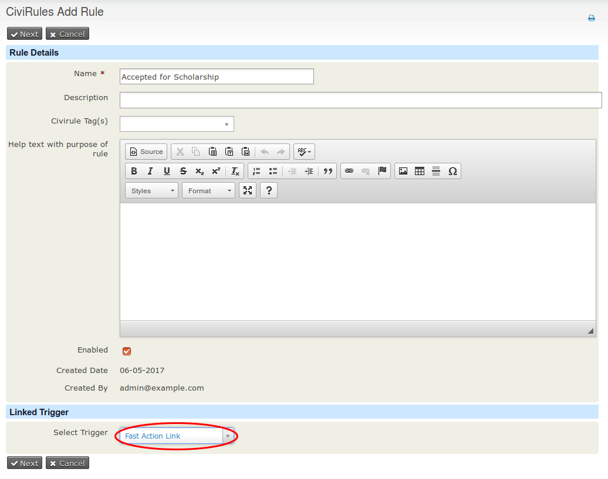
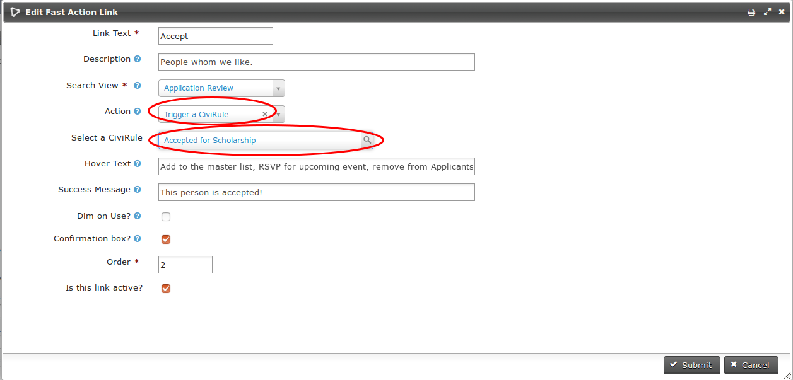

# CiviRules Integration

If you have both the Fast Action Links and CiviRules extensions enabled, a new trigger type will be present in CiviRules called "Fast Action Link" (screenshot 1).
### Configuration
#### In CiviRules
* Go to **CiviRules menu » New Rule**.
* Create a new rule as you normally would in CiviRules, but set the trigger to "Fast Action Link" (screenshot 1).

#### In Fast Action Links
* Create a new fast action link as you normally would.  Set the "Action Type" to "Trigger a CiviRule" (screenshot 2).
* Set "Select a CiviRule" to any CiviRule that has a trigger of "Fast Action Link" (screenshot 2).

Screenshot 1:

Screenshot 2:

