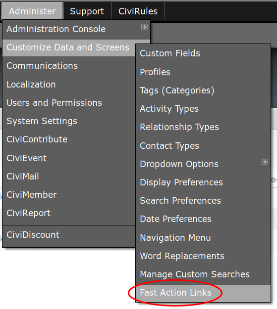

# Installation

* Fast Action Links can be installed from within CiviCRM from the extension directory: **Administer menu » System Settings » Extensions**, on the "Add New" tab.

* For best results, you'll also want a copy of CiviRules installed.  CiviRules can be installed from within CiviCRM from the extension directory: **Administer menu » System Settings » Extensions**, on the "Add New" tab.

After installation, you should have a new menu option available at the CiviCRM **Administration menu » Customize Data and Screens** called **Fast Action Links**.  See screenshot:

