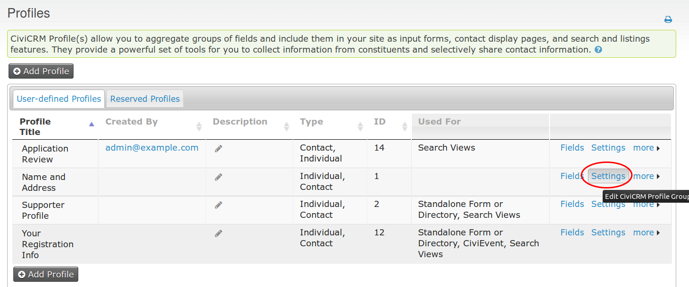
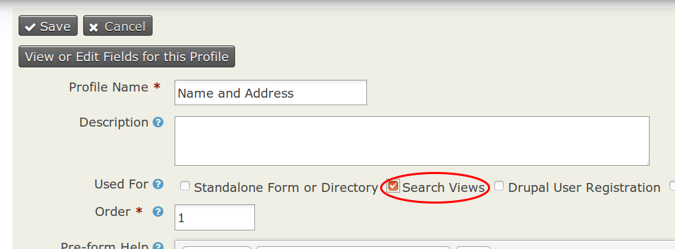
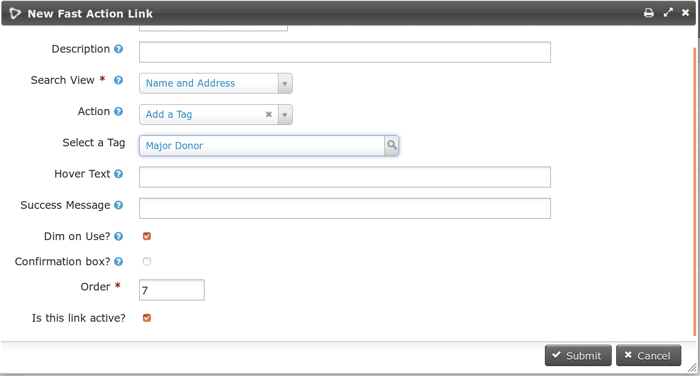

# Quick Start

Here's an example that will let you easily add the "Major Donor" tag to a contact from your search results:

#### Configure a Search View
* Go to **Administration menu » Customize Data and Screens » Profiles**.
* Next to an existing profile, click the "Settings" link (screenshot 1).
* Check the box labeled "Search Views" and press "Save" (screenshot 2).
* Go to the CiviCRM **Administration menu » Customize Data and Screens » Fast Action Links**.

#### Create a Fast Action Link
* Click the "Add Fast Action Link" button.
* Set the values as follows (screenshot 3):
 * Link Text: Test Link
 * Search View: Whichever profile you enabled "Search Views" on in the previous steps.   
 * Action: Add a Tag
 * Select a Tag: Major Donor
* Click "Save".

#### Test your Fast Action Link
* Go to **Search menu » Advanced Search**.
* Change your "Views for Display Contacts" (screenshot 4) to match your Fast Action Link's search view.  Press "Search".
* Next to each contact, you should have a new link called "Test Link".  Clicking this link should add the "Major Donor" tag to the corresponding contact (screenshot 5).

Screenshot 1:

Screenshot 2:

Screenshot 3:

Screenshot 4:

