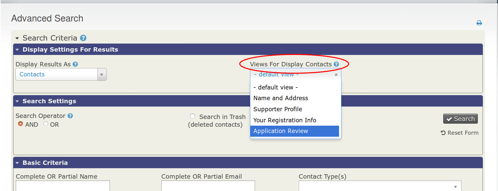

# Daily Usage

To use your Fast Action Links:
* Go to **Search menu » Advanced Search**.
* Change your "Views for Display Contacts" (screenshot 1) to match your Fast Action Link's search view.  Press "Search".
* Next to each contact, you should see your links.  Simply press the link next to the contact you'd like to apply your action to.

Screenshot 1:

